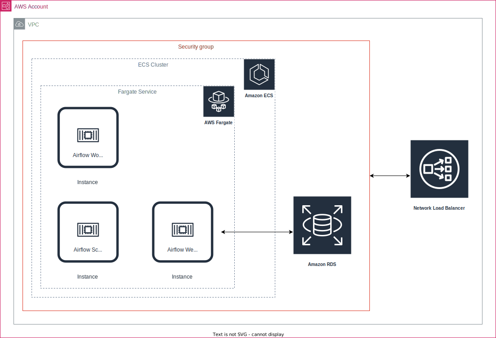
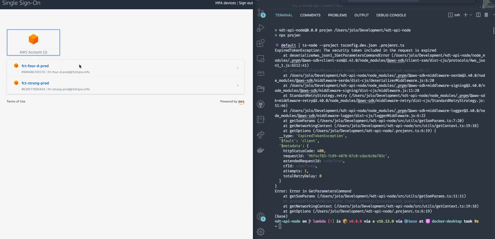

# Airflow on Fargate with AWS Python CDK

## Architecture

The architecture of the infrastructure to be deployed on AWS is shown below.


## Prerequisites

The `cdk.json` file tells the CDK Toolkit how to execute your app.

This project is set up like a standard Python project.  The initialization
process also creates a virtualenv within this project, stored under the `.venv`
directory.  To create the virtualenv it assumes that there is a `python3`
executable in your path with access to the `venv`
package.


## Getting Started

To manually create a virtualenv on MacOS and Linux:

```sh
make install
```

If for any reason the automatic creation of the virtualenv fails,
you can create the virtualenv manually.

```sh
python3 -m venv .venv
source .venv/bin/activate
pip install -r requirements-dev.txt
```

### AWS CDK

Because AWS CDK is written in Typescript, you need to have [`node`](https://nodejs.org/en/) installed.
I would not recommend to install AWS CDK globally, due to version collision.
With having node installed,you should also have [`npx`](https://docs.npmjs.com/cli/v7/commands/npx).

## Commands

At this point you can now synthesize the CloudFormation template for this code.

```sh
make synth # or `npx cdk synth`
```

Before deploying to a real AWS Environment, you need to export your credentials



and run

```sh
make deploy # alternatively: cdk deploy
```

or you pass a profile (should be properly configured `aws configure`)

```sh
make deploy PROFILE=my-profile
```

## Useful commands

- `npx cdk ls`          list all stacks in the app
- `npx cdk synth`       emits the synthesized CloudFormation template
- `npx cdk deploy`      deploy this stack to your default AWS account/region
- `npx cdk diff`        compare deployed stack with current state
- `npx cdk docs`        open CDK documentation
- `npx cdk watch`       watch files and autodeploy it
- `npx cdk destroy`     delete your stack

You can also extend your `Makefile`.

## Troubleshooting

Sometimes it helps to remove the `cdk.out` and do `cdk synth` again.

Enjoy!
